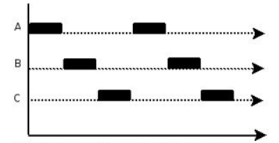

# Go的并发编程

## 1. 并发介绍

### 进程与线程

- **进程**是程序在操作系统中的一次执行过程, 系统进行资源分配和调度的一个**独立单位**.
- **线程**是进程的一个执行实体, 是CPU调度和分派的**基本单位**, 它是比进程更小的能独立运行的基本单位.
- 一个进程可以**创建**和**撤销**多个线程, 同一个进程中的多个线程之间可以**并发**执行.

#### 两者的关系

- **根本区别**: 
  - **进程**是操作系统资源分配的基本单位.
  - **线程**是处理器任务调度和执行的基本单位.

- **资源开销**: 
  - 每个**进程**都有独立的代码和数据空间, 程序之间的切换会有**较大**的开销.
  - **线程**可以看做轻量级的进程, 同一进程的线程共享代码和数据空间, 每个线程都有自己独立的运行栈和程序计数器, 线程之间切换的开销较小
- **内存分配**: 同一进程的**线程**共享本**进程**的地址空间和资源, 而**进程**之间的地址空间和资源是相互独立的.
- **影响关系**: 一个进程崩溃后, 在保护模式下不会对其他进程产生影响, 但是一个线程崩溃整个进程都挂了. 所以多进程要比多线程健壮.
- **执行过程**:  每个独立的进程有程序运行的入口、顺序执行序列和程序出口. 但是线程**不能独立执行**, 必须依存在应用程序中, 由应用程序提供多个线程执行控制. 两者均可并发执行.


### 线程和协程

- **协程**是一个完全由用户实现和控制的"轻量化的**线程**"

- 一个**进程**可以有多个**线程**, 一个**线程**可以多个**协程**
- **协程**最大的优势就是其极高的**执行效率**. 
  - 因为子程序切换不是**线程切换**, 而是由程序自身控制.
  - 因此, 没有线程切换的开销. 
  - 和线程切换相比, 线程数量越多, 协程的性能优势就越明显. 
  - 不需要多线程的**锁**机制, 因为只有一个线程.
  - 也不存在同时写变量冲突, 在协程中控制共享资源不加锁, 只需要判断状态就好了.
  - 所以执行效率比多线程高很多.

- 进程 ⊃ 线程 ⊃ 协程


### 并发与并行

#### 并行

**并行(parallel)**: 指在同一时刻, 有多条指令在多个处理器上同时执行. 就好像两个人各拿一把铁锨在挖坑, 一小时后, 每人一个大坑. 所以无论从微观还是从宏观来看, 二者都是一起执行的.\


#### 并发

**并发(concurrency)**: 指在**同一时刻**只能有**一条指令**执行, 但多个进程指令被快速的**轮换执行**,使得在**宏观上**具有多个进程同时执行的效果, 但在**微观上**并不是同时执行的, 只是把时间分成若干段, 使多个进程快速交替的执行. 这就好像两个人用同一把铁锨, 轮流挖坑, 一小时后, 两个人各挖一个小一点的坑, 要想挖两个大一点得坑, 一定会用两个小时.



#### 两者的关系

- 多线程程序在**一个核**的CPU上运行,就是**并发**.
- 多线程程序在**多个核**的CPU上运行,就是**并行**.
- **并行**是物理上的同时发生, **并发**是逻辑上的同时发生.


### Goroutine

> 这东西太吊了, 这里只是介绍, 后面会单独开一章讲.

Goroutine 是由官方实现的超级"线程池", Go 高并发的根本原因在于其轻量级的协程 (**Goroutine**) 和高效的**调度器**.

- 协程比线程更加轻量.
- [Go 的调度器](#goroutine调度 (GMP))又能够有效地在多个 CPU 核心上调度这些协程, 从而实现高效的并发处理.

Goroutine 奉行通过通信 (Channel) 来共享内存, 而不是共享内存来通信.


## 2. Goroutine

> 在Java/C++中我们要实现并发编程的时候, 我们通常需要自己维护一个线程池, 并且需要自己去包装一个又一个的任务, 同时需要自己去调度线程执行任务并维护上下文切换, 这一切通常会耗费程序员大量的心智. 那么能不能有一种机制, 程序员只需要定义很多个任务,让系统去帮助我们把这些任务分配到CPU上实现并发执行呢?

Go语言中的`Goroutine`就是这样一种机制,  Goroutine的概念类似于线程,但 Goroutine是由Go的运行时 (runtime) 调度和管理的. Go程序会智能地将 goroutine 中的任务合理地分配给每个CPU. Go语言之所以被称为现代化的编程语言, 就是因为它在语言层面已经内置了调度和上下文切换的机制.

在Go语言编程中你不需要去自己写进程, 线程, 协程. 你的技能包里只有一个技能`Goroutine`, 当你需要让某个任务并发执行的时候, 你只需要把这个任务包装成一个函数,开启一个Goroutine去执行这个函数就可以了, 就是这么简单粗暴.

### 使用goroutine

Go语言中使用goroutine非常简单, 只需要在调用函数的时候在前面加上`go`关键字, 就可以为一个函数创建一个goroutine

```go
func hello() {
    fmt.Println("Hello Goroutine!")
}
```

```go
func main() {
    go hello() // 启动另外一个goroutine去执行hello函数
    fmt.Println("main goroutine done!")
}
```

我们会发现, 只打印了main goroutine done, 并没有打印Hello Goroutine! 为什么呢?

这是因为, 在程序启动的时候, Go程序就为`main`函数创建了一个默认的goroutine, 当`main`函数return之后`main`函数中启动的goroutine会一并结束.

所以, 我们需要等待`hello`函数的执行, 我们可以通过`sync.WaitGroup`来实现goroutine的同步, 通过一个计数器, 来记录所有注册了的goroutine, 每执行一个就减去1, 直至为 0 则所有goroutine都结束.

```go
var wg sync.WaitGroup

func hello(i int) {
    defer wg.Done() // goroutine结束就登记-1
    fmt.Println("Hello Goroutine!", i)
}
func main() {

    for i := 0; i < 10; i++ {
        wg.Add(1) // 启动一个goroutine就登记+1
        go hello(i)
    }
    wg.Wait() // 等待所有登记的goroutine都结束
}
```

多次执行上面的代码, 会发现每次打印的数字的顺序都不一致. 这是因为10个goroutine是**并发**执行的, 而goroutine的调度是**随机**的.

### goroutine与线程

#### 可扩容的栈

**OS线程**（操作系统线程）一般都有固定的栈内存（通常为2 MB）, 而一个goroutine的栈在其生命周期开始时只有很小的栈（典型情况下2 KB）, goroutine的栈不是固定的, 他可以按需增大和缩小, goroutine的栈大小限制可以达到1 GB, 虽然极少会用到这个大. 所以在Go语言中一次创建十万左右的goroutine也是可以的. 

####  goroutine调度 (GMP)

**GPM**是Go语言运行时（runtime）层面的实现,是go语言自己实现的一套调度系统. 区别于操作系统调度OS线程.

- G很好理解,就是个**goroutine**的,里面除了存放本goroutine信息外, 还有与所在P的绑定等信息.
- P管理着一组**goroutine队列**, P里面会存储当前goroutine运行的上下文环境（函数指针,堆栈地址及地址边界）, P会对自己管理的goroutine队列做一些**调度**（比如把占用CPU时间较长的goroutine暂停、运行后续的goroutine等等）当自己的队列消费完了就去全局队列里取,如果全局队列里也消费完了会去其他P的队列里抢任务.
- M（machine）是Go运行时（runtime）对操作系统内核线程的虚拟, M与**内核线程**一般是一一映射的关系, 一个goroutine最终是要放到M上执行的.

P与M一般也是一一对应的. 他们关系是:  **P管理着一组G挂载在M上运行**. 当一个G长久阻塞在一个M上时, runtime会新建一个M, 阻塞G所在的P会把其他的G 挂载在新建的M上.  当旧的G阻塞完成或者认为其已经死掉时 GC旧的M.

> P的个数是通过`runtime.GOMAXPROCS`设定（最大256）, Go1.5版本之后默认为物理线程数.  在并发量大的时候会增加一些P和M, 但不会太多, 切换太频繁的话得不偿失.

#### goroutine在调度方面的优势 (轻量的协程+高效的调度器)

单从线程调度讲, Go语言相比起其他语言的优势在于OS线程是由OS内核来调度的, goroutine则是由Go运行时（runtime）自己的调度器调度的.

这个调度器使用一个称为`m:n调度`的技术（复用/调度m个goroutine到n个OS线程）. 其一大特点是goroutine的调度是在**用户态**下完成的, 不涉及内核态与用户态之间的频繁切换, 包括内存的分配与释放,都是在用户态维护着一块大的内存池, 不直接调用系统的`malloc`函数（除非内存池需要改变）成本比调度OS线程低很多. 

另一方面充分利用了多核的硬件资源, 近似的把若干goroutine均分在物理线程上, 再加上本身goroutine的**超轻量**,以上种种保证了go调度方面的性能.


## 3. Channel

> Goroutine 奉行通过通信 (Channel) 来共享内存, 而不是共享内存来通信.

如果说goroutine是Go程序并发的执行体，**channel**就是它们之间的连接。**channel**是可以让一个goroutine发送特定值到另一个goroutine的通信机制.

Go 语言中的通道（channel）是一种特殊的类型。通道像一个传送带或者队列，总是遵循先入先出（First In First Out）的规则，保证收发数据的顺序。每一个通道都是一个具体类型的导管，也就是声明channel的时候需要为其指定元素类型。

### 3.1 Channel的类型

channel是一种类型，一种引用类型。声明通道类型的格式如下:

```go
var [name] chan [type]
// eg:
var ch1 chan int   // 声明一个传递整型的通道
var ch2 chan bool  // 声明一个传递布尔型的通道
var ch3 chan []int // 声明一个传递int切片的通道
```

### 3.1.2 创建channel

通道是引用类型，通道类型的空值是`nil`.

```go
var ch chan int
fmt.Println(ch) // <nil>
```

声明的通道后需要使用`make`函数初始化之后才能使用。

创建channel的格式如下：

```go
make(chan [type], [bufferSize])
// eg:
ch4 := make(chan int)
ch5 := make(chan bool)
ch6 := make(chan []int)
```

channel的`bufferSize`是**可选**的.

### 3.1.3 channel的操作

通道有**发送**（send）、**接收**(receive）和**关闭**（close）三种操作。

发送和接收都使用<-符号。

现在我们先使用以下语句定义一个通道：

```go
ch := make(chan int)
```

#### 发送

将一个值发送到通道中。

```go
ch <- 10 // 把10发送到ch中
```

#### 接收

从一个通道中接收值。

```go
x := <- ch // 从ch中接收值并赋值给变量x
<-ch       // 从ch中接收值，忽略结果
```

#### 关闭

我们通过调用内置的close函数来关闭通道。

```go
close(ch)
```

关于关闭通道需要注意的事情是:

- 只有在通知接收方goroutine所有的数据都发送完毕的时候才需要关闭通道
- **通道**是可以被**垃圾回收机制回收**的
- 它和**关闭文件**是不一样的, 在结束操作之后关闭文件是**必须**要做的, 但关闭通道**不是必须**的。

**关闭后的通道**有以下特点：

- 再发送值就会导致<span style="color: red;">**Panic**</span>
- 进行接收, 会一直获取缓冲里的值, 直到通道为空, 而后再接收会获取到 对应类型的**空值**, 并返回**false**
- 关闭一个已经关闭的通道会导致<span style="color: red;">**Panic**</span>

### 3.1.4 无缓冲的Channel


无缓冲的channel是阻塞的.

比如说以下代码:

```go
func main() {
    ch := make(chan int)
    ch <- 10
    fmt.Println("发送成功")
}
```

虽然可以通过编译, 但是运行后会发现:

```go
 fatal error: all goroutines are asleep - deadlock!
```

这是因为:

- 我们在创建channel的时候没有指定`bufferSize`, 则创建的是**无缓冲**的通道.

- 因为没有缓冲去暂存, 所以无缓冲的通道只有在有人接收值的时候才能发送值.

- 一种解决方法是, 起一个goroutine去接收, 这里不展开.

使用无缓冲通道进行通信, 将导致发送和接收的goroutine同步化, 因此，无缓冲通道也被称为**同步通道**。

### 3.1.5 有缓冲的channel

解决上面问题的方法还有一种就是使用**有缓冲区的**通道, 如下图所示:


创建channel的时候指定`bufferSize`, 则创建的是**有缓冲**的通道.

当缓冲区被填满时, 在往里传值将阻塞.

~~我们可以使用内置的len函数获取通道内元素的数量，使用cap函数获取通道的容量~~.(基本上没必要)

### 3.1.6 关闭Channel

我们使用`close()`来关闭一个channel.

如果你的管道不往里存值或者取值的时候一定记得关闭管道, 避免内存泄漏.

### 3.1.7 循环取值

```go
for {
    i, ok := <-ch1 // 通道关闭后再取值ok=false
    if !ok {
        break
    }
}
```

###  3.1.8 单向通道

```go
chan<- int // 只能进
<-chan int // 只能出
```


