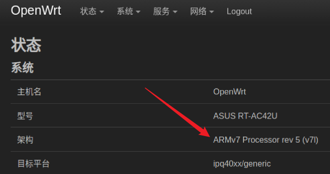
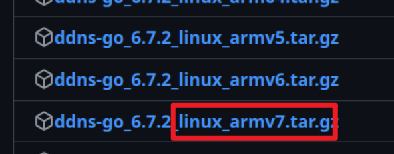
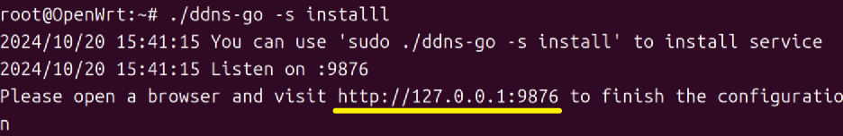
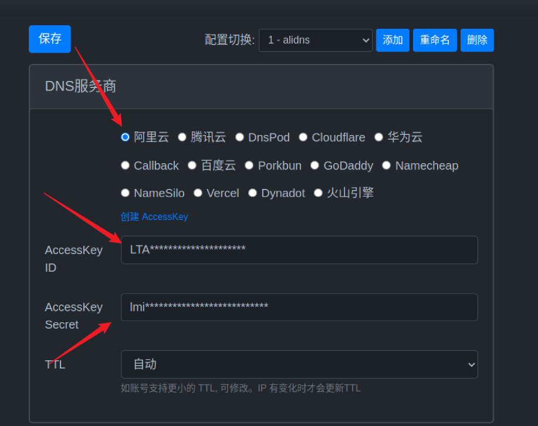
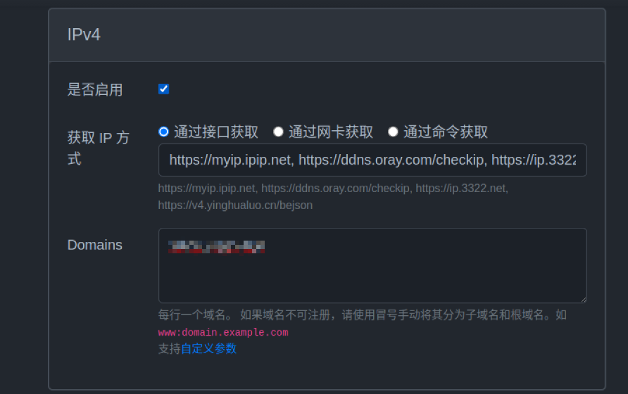
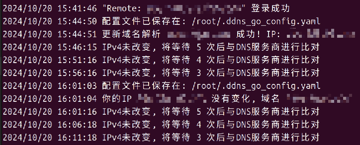

# 在OpenWrt部署阿里云域名的DDNS

校园网送我个公网ip, 不用白不用

使用Github开源项目: https://github.com/jeessy2/ddns-go

自动获得你的公网 IPv4 或 IPv6 地址，并解析到对应的域名服务。

支持的域名服务商 `阿里云` `腾讯云` `Dnspod` `Cloudflare` `华为云` `Callback` `百度云` `Porkbun` `GoDaddy` `Namecheap` `NameSilo` `Dynadot`

## 1. 注册一个域名

加油

## 2. 申请一个AccessKey

登陆阿里云<a href="https://ram.console.aliyun.com/overview">RAM控制台</a>, 新建一个子帐户, 并为子账户配置`AliyunDNSReadOnlyAccess`和`AliyunDNSFullAccess`的权限策略.

然后创建一个`AccessKey`, 并**记住它**

## 3. 在openWrt中使用DDns-Go

## 3.1 查看系统架构

在OpenWrt-状态-系统-架构里可以看到自己路由器的系统架构



## 3.2 下载对应的包

在 <a href="https://github.com/jeessy2/ddns-go/releases">Release</a>下载对应的包, 注意要选择**Linux**系统的包



## 3.3 把包推送到路由器

**Linux**下, 我们可以使用scp命令, 把文件推到路由器.

```bash
scp -O <filename> root@[ip]:[path]
```

比如说:

```
scp -O ddns-go root@192.168.1.1:/root
```


**Windows**的小伙伴可以参考<a href="https://www.baidu.com/s?wd=windows%E6%80%8E%E4%B9%88%E6%8A%8A%E6%96%87%E4%BB%B6%E4%BC%A0%E5%88%B0Linux%E6%9C%8D%E5%8A%A1%E5%99%A8">windows怎么把文件传到Linux服务器</a>.

## 3.4 运行安装

使用ssh连接上OpenWrt后, 我们cd到`ddns-go`文件所在的目录下, 执行

```bash
./ddns-go -s install
```

当我们看到下图所示的连接后, 我们可以通过 **网关ip+端口**的形式访问到**web配置页**, 比如说我的就是:192.168.1.1:9876



## 3.5 简单的配置

选择指定的域名商, 添加刚才让你记住的`AccessKey`和`SecretKey`.



添加自己的域名 比如说我想绑定我自己的二级域名 **aaa.example.com**, 那就填写**aaa:example.com**



然后保存

## 3.6 配置域名解析

进入<a href="https://dc.console.aliyun.com/">阿里云域名控制台</a> > 域名列表 > 选择你的域名 > 域名解析 >添加记录

我们添加一个**A记录**用于ipv4, 主机记录填我们刚才填的**aaa**, 记录值可以随便填, 只要符合ip规则即可, 后续我们的ddns服务会自动的更新公网ip


不出意外, 我们的记录值会自动的更新


终端也会输出



那么恭喜你,成功的配置好了DDns!

## 4. 太好了! 终于配好了

简单部署一个go的服务上去测试一下!

```go
package main

import (
	"io"
	"net/http"
)

func pingHandler(w http.ResponseWriter, r *http.Request) {
	if r.URL.Path != "/ping" {
		http.NotFound(w, r)
		return
	}
	io.WriteString(w, "pong")
}

func main() {
	http.HandleFunc("/ping", pingHandler)
	http.ListenAndServe(":8080", nil)
}

```

不出以外, 也是可以通过域名访问的到的. 


