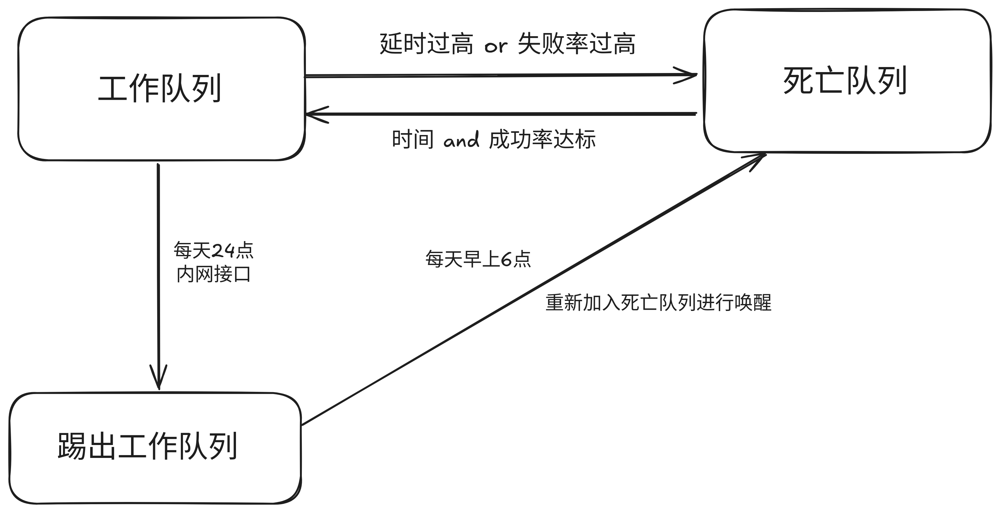

# 流量切换以及负载均衡方案(初稿)

## **当前的问题**

目前有四条api可以从zf获取数据

- 外网统一
- 内网统一
- 外网正方
- 内网正方

四条api都存在着不稳定的特点，响应时间也较长。同时内网会在晚上自动屏蔽，这也给负载带来了挑战

对于响应时间较长的问题，可以使用负载均衡在最大限度上提供保障。

但是由于api不稳定的特性，就有必要检测api的健康状态，需要在一条api出现问题的时候自动将api从负载均衡的列表中移除，并在恢复健康后重新添加到列表中。

## **目前的方案**

### **思路**

根据gin反馈的接口反馈(请求耗时, 状态码), 记录请求的**失败率**以及请求的**耗时**等,结合多个参数对四条线路评估, 用于评估该条线路的质量. 便于进行分流.

### **工作队列**

使用一个**优先队列**用于维护所有**参与请求处理**的线路, 根据线路的质量来评判**优先级**, 优先级高的优先参与请求的处理, 当一个线路挂了, 就将其加入**死亡队列**进行**唤醒**.

### **死亡队列**

死亡队列用于存放在工作队列中挂掉的线路, 单独起一个goroutine来定时发送请求来**唤醒**, 直到可以**成功请求**并**延时优秀**再将其重新添加回工作队列, 并赋予**低优先级(避免抖动,**让其重新参与底层工作,通过工作队列的竞争机制来获得高优先级**)**

### **如何去维护工作队列**

使用**redis**记录最近**十分钟**的所有请求, 每隔一定时间起一个goroutine进行一次**统计**以及**排序**并**更新工作队列**

### **更新工作队列**

更新工作队列时为了保证请求的稳定性, 不能修改原工作队列, 而是新开一个工作队列, 并在完成统计工作后将请求指向新的工作队列. **重定向的过程得加锁, 应该是并发造成的数据不一致问题**

### **负载均衡策略**

根据工作队列, 分配任务量给各个线路,

<script id="MathJax-script" async  src="https://cdn.jsdelivr.net/npm/mathjax@3/es5/tex-chtml.js"></script

$$
流量分配比例:T_i=\left(\frac{\frac{1}{x_i}}{\sum \frac{1}{x_i}}\right) \times 100\%   (其中x_i表示线路i的延时)
$$

采用加权[随机法](https://www.pdai.tech/md/algorithm/alg-domain-load-balance.html#随机法-random)生成一个0-1的随机浮点数来决定采用哪个线路.

### **告警**

当有线路长时间在死亡队列中(2h?), 无法唤醒, 发邮件告警.

### **针对内网的处理**

1. 每天24点后自动把内网的接口踢出**工作队列**.
2. 每天6点把内网接口加入**死亡队列**进行**唤醒**.

   
   
   
